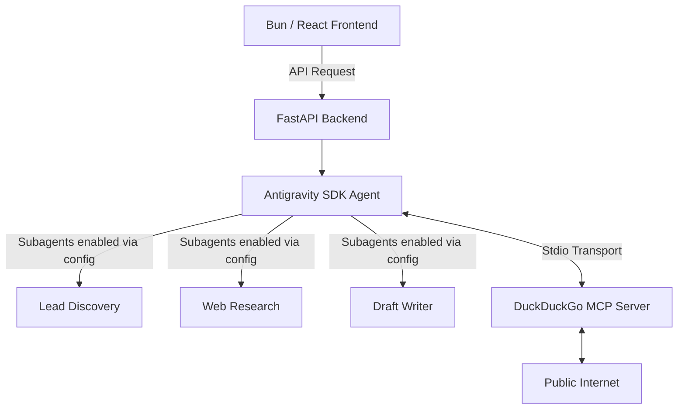

# Vibe LeadGen Agents (Local B2B Outreach)

A Full-Stack Kaggle Capstone Project demonstrating the power of the Google Antigravity SDK, Model Context Protocol (MCP), and Multi-Agent Systems.

## The Problem
Local B2B service providers (commercial cleaners, IT support, caterers) struggle to find and engage new local businesses. Generic cold emails end up in spam, and manually researching leads is time-consuming.

## The Solution
This project introduces a Multi-Agent System that:
1. Uses a DuckDuckGo MCP Server to find hyper-local businesses matching a specific profile.
2. Researches those businesses autonomously.
3. Drafts highly personalized, non-spammy outreach emails.
4. Presents them in a sleek, glassmorphic UI for human review before sending.

## Architecture



## Setup Instructions

### 1. Backend (Python + Antigravity)
```bash
cd backend
python3 -m venv venv
source venv/bin/activate
pip install -r requirements.txt
```
Create a `.env` file in the `backend/` directory and add your Gemini API Key:
```
GEMINI_API_KEY=your_key_here
```
Run the server:
```bash
python main.py
```

### 2. Frontend (Bun + React)
```bash
cd frontend
bun install
bun run dev
```

Navigate to the localhost port provided by Vite and configure your business to dispatch the agents!
